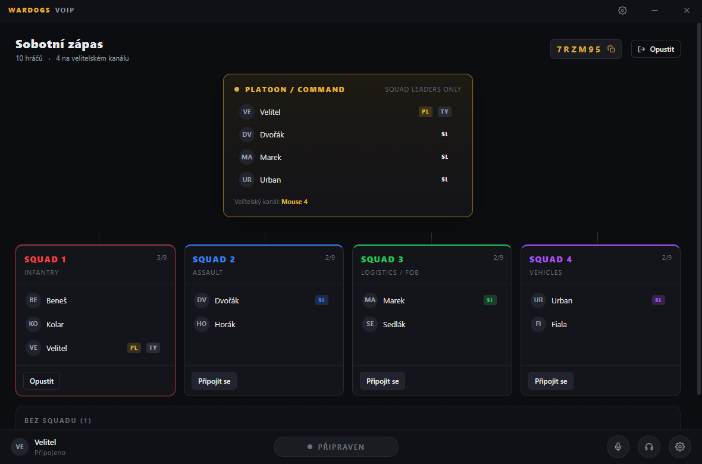

# Wardogs VOIP

Platoon-style hlasová komunikace pro Wardogs: čtyři izolované squad kanály a nad
nimi velitelský kanál, na který se dostanou jen velitelé squadů.

Velitel squadu je připojený na **dva kanály současně** — na svůj squad a na
command. Každý má vlastní klávesu. To je celý smysl aplikace: velitelé se domluví
mezi sebou, aniž by to slyšelo devět lidí v jejich squadu, a pak zadají rozkaz
svému squadu na druhé klávese.

```
                    ┌─────────────────────────┐
                    │  PLATOON / COMMAND      │   jen velitelé squadů
                    │  velitel platoonu + SL  │
                    └────┬────┬────┬────┬─────┘
                         │    │    │    │
              ┌──────────┘    │    │    └──────────┐
              │          ┌────┘    └────┐          │
        ┌─────▼─────┐ ┌──▼────────┐ ┌───▼───────┐ ┌▼──────────┐
        │  SQUAD 1  │ │  SQUAD 2  │ │  SQUAD 3  │ │  SQUAD 4  │
        │ Infantry  │ │  Assault  │ │ Log./FOB  │ │ Vehicles  │
        └───────────┘ └───────────┘ └───────────┘ └───────────┘
```

**[Stáhnout nejnovější verzi](https://github.com/PMizenko/wardogs-comms/releases/latest)**
— `WardogsVOIP-Setup-*.exe` je instalátor, `WardogsVOIP-Portable-*.exe` běží bez
instalace. Aplikace se pak aktualizuje sama.



---

## Jak to funguje

Tři části, každá dělá jednu věc:

| Část | Co dělá |
| --- | --- |
| **Řídicí server** (`packages/server`) | Identita, roster platoonu, oprávnění. Vydává krátkodobé LiveKit tokeny. Hlas jím **neprochází**. |
| **LiveKit SFU** | Přenáší zvuk. Každý kanál je samostatná LiveKit místnost. |
| **Desktop klient** (`packages/desktop`) | Electron: ovládací okno, in-game overlay, globální push-to-talk, dvě LiveKit připojení současně. |

### Oprávnění jsou vynucená tokenem, ne UI

Token je vždy vystavený **na jednu konkrétní místnost**. Řadový člen squadu
prostě nikdy nedostane token pro command místnost, takže se na ni nemá jak
dostat — ani upraveným klientem. Když velitele degraduješ, server mu při další
změně rosteru vystaví nové tokeny bez command místnosti a klient to spojení
zahodí.

Ověřeno testem: `npm run smoke` projede 36 kontrol včetně dekódování těch JWT.

### Vysílání je exkluzivní

Nemůžeš říkat dvě věci najednou, takže:

1. držená **command** klávesa přebije všechno,
2. pak držená **squad** klávesa,
3. teprve pak otevřený mikrofon.

Zároveň to řeší jediný případ, kdy by tě někdo mohl slyšet dvakrát.

### Velitel má přednost

Když mluví velitel squadu, ostatní hlasy klesnou na 20 %. Když mluví velitel
platoonu, klesnou i velitelé squadů. Stejné hodnosti se navzájem neztlumí, takže
dva velitelé si na command kanálu normálně popovídají.

Platí to **napříč kanály** — to je ten hlavní případ: jsi velitel squadu,
dostáváš rozkaz na command a tvůj squad zrovna žvaní. Chatter jde dolů, rozkaz
uslyšíš.

Hlasitost se nepřepíná skokem, ale sjede za ~120 ms, jinak to uprostřed slabiky
lupne. Vypnout nebo přenastavit jde v *Nastavení → Zvuk*.

Rozhodovací tabulku hlídá `npm run test:ducking` — obrácené porovnání by ztišilo
velitele místo žvanění, což je přesně naopak.

---

## Rozjetí

Potřebuješ **Node 20+** a **Docker** (na LiveKit).

```bash
npm install
cp .env.example .env
```

Do `.env` vyplň aspoň `JWT_SECRET`. Pro první spuštění bez Discordu nastav
`ALLOW_DEV_LOGIN=true` (viz níže).

Ve třech terminálech:

```bash
npm run livekit
```

```bash
npm run dev:server
```

```bash
npm run dev:desktop
```

Kontrola, že hlasová část stojí:

```bash
npm run check:livekit
```

---

## Přihlášení přes Discord

1. Na <https://discord.com/developers/applications> založ aplikaci.
2. V **OAuth2** zkopíruj *Client ID* a *Client Secret* do `.env`.
3. Tamtéž přidej redirect URI — přesně tohle, včetně cesty:

   ```
   http://localhost:4000/auth/discord/callback
   ```

   V produkci `https://voip.alesza.eu/auth/discord/callback` a stejnou adresu dej
   do `PUBLIC_URL`.
4. Volitelně `DISCORD_REQUIRED_GUILD_ID` — pak se přihlásí jen členové tvého
   Discord serveru.

Přihlašování běží v **systémovém prohlížeči**, ne v okně aplikace. Heslo tak
zadáváš jen Discordu a aplikace se k němu nedostane; zpátky se vrací jen
potvrzená identita přes odkaz `wardogs-voip://auth`.

### Testovací přihlášení bez Discordu

`ALLOW_DEV_LOGIN=true` zapne `/auth/dev/*`, kde se přihlásíš libovolným jménem
bez ověření. Je to pro lokální vývoj — hlavně proto, že si tak na jednom stroji
otevřeš čtyři klienty a vyzkoušíš celý platoon.

**Je to obcházení autentizace.** Server to odmítne zapnout při
`NODE_ENV=production` a nikdy to nesmí běžet na veřejné adrese.

---

## Klávesy

Aplikace používá nativní systémový odchyt vstupu, takže push-to-talk funguje i
když je v popředí hra. Bindovat jde klávesa i boční tlačítko myši (Mouse 4/5).

Ve výchozím stavu **není nabindované nic** — jakákoli výchozí klávesa by se někomu
tloukla s ovládáním hry. Aplikace tě na to na hlavní obrazovce upozorní.

| Akce | K čemu |
| --- | --- |
| Squad | Mluví jen tvůj squad |
| Command | Jen pro velitele squadů, přebíjí squad |
| Přepnout mikrofon | Rychlé ztlumení sebe |
| Přepnout zvuk | Ztlumí i poslech (a tím i mikrofon) |

Když píšeš do textového pole v aplikaci, odchyt se automaticky pozastaví.

---

## Overlay ve hře

Průhledné okno bez rámečku, neklikatelné, drží se nad ostatními okny. Ukazuje na
jaký kanál zrovna vysíláš a kdo mluví.

**Windows:** overlay se vykreslí jen nad hrou v režimu *okno* nebo *bez okrajů*.
V exkluzivním fullscreenu ho systém nad hru nepustí — to není chyba aplikace,
takhle to má Windows postavené.

Roh, velikost a „skrýt, když je klid" se nastavují v aplikaci.

---

## Instalátor pro lidi

```bash
npm run dist:release -- https://voip.alesza.eu
```

Vypadne z toho do `packages/desktop/release/`:

| Soubor | Pro koho |
| --- | --- |
| `WardogsVOIP-Setup-0.1.0.exe` | Normální instalátor — zástupci, odinstalace, registrace `wardogs-voip://` odkazů |
| `WardogsVOIP-Portable-0.1.0.exe` | Jeden soubor, žádná instalace. Na rychlé vyzkoušení |

Uživatel stáhne, spustí, přihlásí se Discordem. **Adresu serveru nikde nezadává** —
je zapečená v buildu.

### Adresa serveru se zapéká při buildu

Proto to nepouštěj jako `npm run dist`, ale přes `dist:release` s adresou.
Skript **odmítne** vyrobit release mířící na `localhost` — takový build se
nainstaluje, vypadá funkčně a nikdo se nepřipojí. Adresu můžeš taky nastavit
jednou v `.env` jako `WARDOGS_SERVER_URL` a pak stačí `npm run dist:release`.

Kdo si točí vlastní server, přepne si adresu v aplikaci v *Nastavení → Účet →
Server*. Odhlásí ho to, protože přihlašovací token platí jen na serveru, který
ho vydal.

### SmartScreen

Build není podepsaný, takže Windows při prvním spuštění ukáže modrou cedulku
„Windows ochránil váš počítač". Uživatel musí kliknout na **Další informace →
Přesto spustit**.

Napiš to lidem rovnou do zprávy, se kterou soubor rozdáváš — jinak si polovina
lidí myslí, že je to vir, a nespustí to.

Zbavíš se toho jedině **code signing certifikátem** (OV zhruba 200-400 $/rok,
EV dráž, ale bez rozjezdové fáze reputace). Pak stačí do `.env` přidat:

```
CSC_LINK=cesta/k/certifikatu.pfx
CSC_KEY_PASSWORD=heslo
```

electron-builder to podepíše sám, nic dalšího měnit nemusíš.

### Aktualizace v aplikaci

Aplikace se umí aktualizovat sama z GitHub Releases. Uživatel klikne v
*Nastavení → Aktualizace* na **Zkontrolovat aktualizace**; když je novější
verze, stáhne se na druhé kliknutí a nainstaluje po restartu.

Stahování je schválně na samostatné kliknutí — 80 MB, které si samo začne
téct uprostřed zápasu, nikoho nepotěší. Jedna tichá kontrola proběhne 12 s po
startu, ale jen naplní stav; nic nevyskočí.

Vydání nové verze:

```bash
npm run publish:release -- 0.2.0
```

Skript zkontroluje, že repozitář existuje, že verze ještě není vydaná a že
build nemíří na localhost, pak sestaví a nahraje release na GitHub. Vznikne
jako **draft** — dopiš, co se změnilo, a publikuj. Instalované kopie vidí jen
publikované release.

Verze musí jít nahoru, jinak to klienti nevezmou jako aktualizaci.

**Přenosná verze se neaktualizuje** — nemá co předat instalátoru. Aplikace to
v nastavení rovnou napíše místo toho, aby tlačítko nefungovalo.

**Repozitář musí být veřejný.** Updater stahuje release bez přihlášení; u
privátního by každý klient potřeboval GitHub token.

### Kam soubory dát

Release visí na GitHubu, takže lidem stačí poslat odkaz:

```
https://github.com/PMizenko/wardogs-comms/releases/latest
```

Ten odkaz vždycky ukazuje na poslední verzi, takže ho nemusíš po každém vydání
měnit. Do Discordu patří odkaz, ne soubor — příloha má limit 25 MB.

### macOS a Linux

```bash
npm run dist:all
```

Musí běžet na dané platformě (macOS build nejde udělat z Windows). macOS navíc
bez notarizace nepustí aplikaci spustit bez obcházení Gatekeeperu.

---

## Nasazení na voip.alesza.eu

### 1. Řídicí server za HTTPS

Doména je na Cloudflare a teď vrací **525 (SSL handshake failed)** — Cloudflare
se nedomluví s origin serverem. Buď dej origin pod platný certifikát (Let's
Encrypt) a v Cloudflare zvol SSL/TLS režim **Full (strict)**, nebo pro rychlý
start **Flexible**, kdy Cloudflare mluví na origin po HTTP.

Reverse proxy musí propouštět WebSocket upgrade na `/ws`:

```nginx
server {
  server_name voip.alesza.eu;

  location / {
    proxy_pass http://127.0.0.1:4000;
    proxy_http_version 1.1;
    proxy_set_header Upgrade $http_upgrade;
    proxy_set_header Connection "upgrade";
    proxy_set_header Host $host;
    proxy_set_header X-Forwarded-For $proxy_add_x_forwarded_for;
    proxy_read_timeout 3600s;
  }
}
```

V `.env` na serveru:

```
PUBLIC_URL=https://voip.alesza.eu
ALLOW_DEV_LOGIN=false
JWT_SECRET=<openssl rand -hex 32>
```

`ALLOW_DEV_LOGIN` **musí být vypnuté** — jinak se kdokoli přihlásí jako kdokoli.
Server ho odmítne zapnout při `NODE_ENV=production`, ale nespoléhej na to.

### 2. LiveKit NESMÍ jít přes Cloudflare proxy

Tohle je past, do které spadne skoro každý. Hlas je **WebRTC přes UDP** a HTTP
proxy ho neunese. Kdyby SFU běželo za oranžovým mráčkem, signalizace by se
připojila, roster by naskočil — a nikdo by nikoho neslyšel.

Dej SFU vlastní záznam, například `sfu.alesza.eu`, a v Cloudflare ho přepni na
**DNS only (šedý mráček)**. Na tom stroji otevři:

| Port | Protokol | K čemu |
| --- | --- | --- |
| 443 nebo 7880 | TCP | signalizace (WSS) |
| 7881 | TCP | WebRTC fallback, když UDP neprojde |
| 50000–50100 | **UDP** | vlastní zvuk |

Pak v `.env` řídicího serveru:

```
LIVEKIT_URL=wss://sfu.alesza.eu
LIVEKIT_API_KEY=<vlastni>
LIVEKIT_API_SECRET=<vlastni>
```

Tuhle adresu dostávají klienti až za běhu, takže **není zapečená v instalátoru** —
můžeš SFU přestěhovat bez nového buildu.

Vlastní klíče (ty v `livekit.yaml` jsou vývojové a veřejně známé):

```bash
docker run --rm livekit/generate --local
```

### 3. Discord OAuth

V Discord Developer Portalu přidej redirect URI přesně takhle:

```
https://voip.alesza.eu/auth/discord/callback
```

### 4. Kontrola

```bash
npm run check:livekit
```

---

## Struktura

```
packages/
  shared/     typy a protokol sdílené serverem i klientem
  server/     Fastify + WebSocket, Discord OAuth, vydávání LiveKit tokenů
    platoon/manager.ts    roster, squady, leader sloty, reconnect grace
    livekit/tokens.ts     oprávnění → tokeny
    ws/gateway.ts         řídicí socket
  desktop/
    src/main/             Electron: okna, overlay, globální klávesy, OAuth
    src/renderer/         React UI
      voice/engine.ts     dvě LiveKit místnosti, push-to-talk, směšování
scripts/
  smoke-test.mjs          end-to-end test řídicího toku a oprávnění
  dev-platoon.mjs         naplní server hráči, ať je na čem ladit UI
  check-livekit.mjs       ověří dostupnost SFU a shodu klíčů
```

---

## Příkazy

| Příkaz | Co dělá |
| --- | --- |
| `npm run dev` | Server i klient najednou |
| `npm run livekit` | LiveKit SFU v Dockeru |
| `npm run smoke` | 36 kontrol řídicího toku (server musí běžet) |
| `npm run dev:platoon` | Vytvoří platoon s 10 hráči a drží ho |
| `npm run check:livekit` | Diagnostika hlasové části |
| `npm run typecheck` | Typová kontrola všech balíčků |
| `npm run dist:release -- <url>` | Instalátor k rozdání, s adresou serveru |
| `npm run publish:release -- <verze>` | Vydá release na GitHub, odkud se klienti aktualizují |
| `npm run test:ducking` | Tabulka priorit ztlumení |
| `npm run dist` | Build bez kontrol (vývojový) |

---

## Provozní poznámky

- **Platoon žije v paměti.** Restart serveru znamená, že si lidi znovu zadají
  kód. Zápas trvá půl hodiny, databáze by tu byla navíc.
- **Výpadek spojení nestojí místo.** Server drží slot 45 sekund, takže pád hry
  do desktopu neznamená, že o velení přijdeš.
- **Velikosti:** 9 lidí na squad, 40 na platoon. Změníš v `packages/server/src/config.ts`.
- **V produkci** dej server za HTTPS (`PUBLIC_URL=https://…`), LiveKit za `wss://`
  a vygeneruj si vlastní klíče:
  ```bash
  docker run --rm livekit/generate --local
  ```

## Co zatím není

- Přetahování hráčů myší mezi squady (velitel je přiřazuje tlačítky na lavičce).
- Hlasitost po jednotlivých hráčích.
- Rádiový efekt na command kanálu.
- Perzistentní platoony a statistiky.
